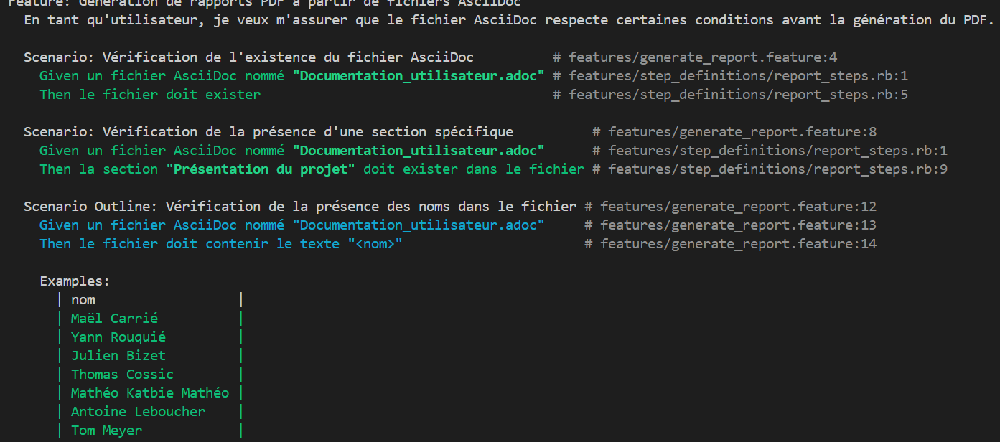

= R5.A.08 -- Dépôt pour les TPs
:icons: font
:MoSCoW: https://fr.wikipedia.org/wiki/M%C3%A9thode_MoSCoW[MoSCoW]

Ce dépôt concerne les rendus de mailto:thomas.cossic@gmail.com[Thomas Cossic].

== TP1

is_it_friday_yet.feature
[source,java]
---
Feature: Est-ce vendredi ?

    Tous le monde veut savoir si c'est vendredi

    Scenario: Demande si c'est vendredi
        Given aujourd'hui est "mardi"
        When je demande si c'est vendredi
        Then je devrais obtenir "Nope"

    Scenario Outline: Friday is Friday
        Given aujourd'hui est "<day>"
        When je demande si c'est vendredi
        Then je devrais obtenir "<answer>"

        Examples:
            | day            | answer |
            | vendredi       | TGIF   |
            | dimanche       | Nope   |
            | anything else! | Nope   |

---

.Tests réussis
image::tests.png[width=80%]

== TP2

Order.java
[source,java]
---
package cucumber_demo;

import java.util.ArrayList;
import java.util.List;

public class Order {
    private String owner;
    private String target;
    private List<String> cocktails = new ArrayList<>();

    public void declareOwner(String owner) {
        this.owner = owner;
    }

    public void declareTarget(String target) {
        this.target = target;
    }

    public List<String> getCocktails() {
        return cocktails;
    }
}
---

.Tests réussis
image::test2.png[width=80%]

== TP3

generate_report.feature
[source,feature]
---
Feature: Génération de rapports PDF à partir de fichiers AsciiDoc
  En tant qu'utilisateur, je veux m'assurer que le fichier AsciiDoc respecte certaines conditions avant la génération du PDF.

  Scenario: Vérification de l'existence du fichier AsciiDoc
    Given un fichier AsciiDoc nommé "Documentation_utilisateur.adoc"
    Then le fichier doit exister

  Scenario: Vérification de la présence d'une section spécifique
    Given un fichier AsciiDoc nommé "Documentation_utilisateur.adoc"
    Then la section "Présentation du projet" doit exister dans le fichier

  Scenario Outline: Vérification de la présence des noms dans le fichier
    Given un fichier AsciiDoc nommé "Documentation_utilisateur.adoc"
    Then le fichier doit contenir le texte "<nom>"

    Examples:
      | nom                  |
      | Maël Carrié          |
      | Yann Rouquié         |
      | Julien Bizet         |
      | Thomas Cossic        |
      | Mathéo Katbie Mathéo |
      | Antoine Leboucher    |
      | Tom Meyer            |
---

report_steps.rb
[source,rb]
---
Given('un fichier AsciiDoc nommé {string}') do |filename|
  @filename = filename
end

Then('le fichier doit exister') do
  expect(File.exist?(@filename)).to be true
end

Then('la section {string} doit exister dans le fichier') do |section_title|
  content = File.read(@filename)
  expect(content).to include(section_title)
end

Then('le fichier doit contenir le texte {string}') do |expected_text|
  content = File.read(@filename)
  expect(content).to include(expected_text)
end

---

=Objectifs TP3

Le but de ce TP est de vérifier que la documentation utilisateur respecte certaines conditions.

.Tests réussis
