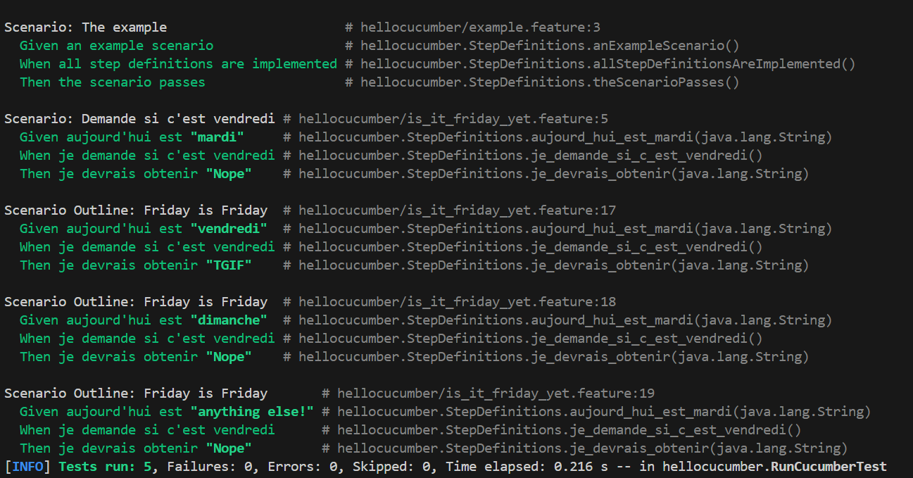
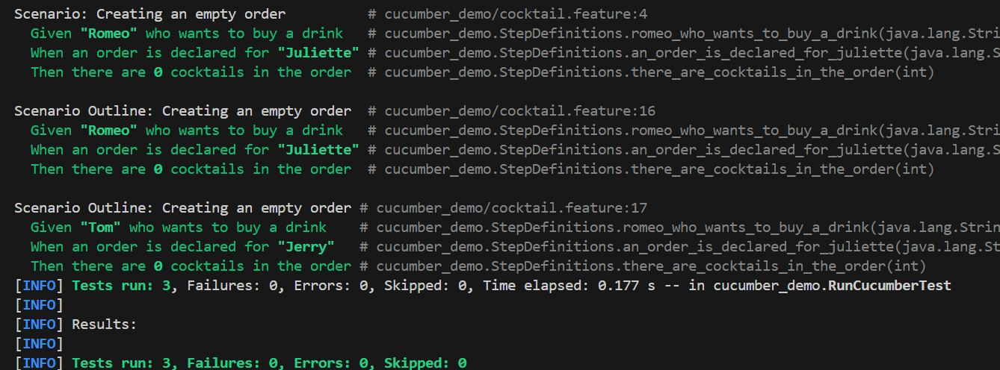

= R5.A.08 -- Dépôt pour les TPs
:icons: font
:MoSCoW: https://fr.wikipedia.org/wiki/M%C3%A9thode_MoSCoW[MoSCoW]

Ce dépôt concerne les rendus de mailto:thomas.cossic@gmail.com[Thomas Cossic].

== TP1

is_it_friday_yet.feature
[source,java]
---
Feature: Est-ce vendredi ?

    Tous le monde veut savoir si c'est vendredi

    Scenario: Demande si c'est vendredi
        Given aujourd'hui est "mardi"
        When je demande si c'est vendredi
        Then je devrais obtenir "Nope"

    Scenario Outline: Friday is Friday
        Given aujourd'hui est "<day>"
        When je demande si c'est vendredi
        Then je devrais obtenir "<answer>"

        Examples:
            | day            | answer |
            | vendredi       | TGIF   |
            | dimanche       | Nope   |
            | anything else! | Nope   |

---

.Tests réussis

== TP2

Order.java
[source,java]
---
package cucumber_demo;

import java.util.ArrayList;
import java.util.List;

public class Order {
    private String owner;
    private String target;
    private List<String> cocktails = new ArrayList<>();

    public void declareOwner(String owner) {
        this.owner = owner;
    }

    public void declareTarget(String target) {
        this.target = target;
    }

    public List<String> getCocktails() {
        return cocktails;
    }
}
---

.Tests réussis
